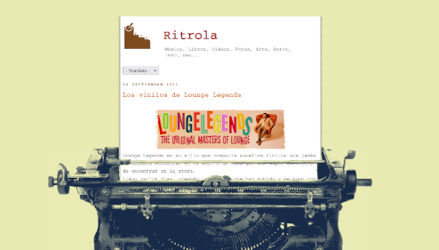

# ritrola
 
## Plantilla para Blogger. 
Ritrola fue proyecto de blog con temática vintage, desarrollado desde el año 2009. 
La idea fue crear una plantilla que simule la lectura de una hoja en máquina de escribir.
### Archivos. 
Se incluye el directorio files de este repo. El cual, incluye los adicionales como imágenes, hojas de estilo, xml(plantilla_blogger).  
### Versión.
La plantilla se creo para una versión antigua de blogger. 
Es posible que algunas cualidades no funcionen adecuadamente. 
### Aportar.
Se agradece el soporte colaborativo para editar/añadir/suprimir secciónes del lenguaje en xml.  
Gracias. 

